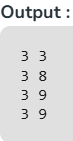
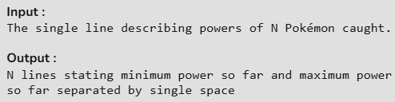

# 🧢 Pokémon Training Game (Python)

## 📌 Overview
You are a Pokémon trainer traveling through different regions and catching Pokémon.  
Each Pokémon has a **power level** represented by a positive integer.

After catching each Pokémon, you must immediately display:
- The **minimum power**
- The **maximum power**

of all Pokémon caught so far.

⚡ The solution must run in **linear time O(N)**  
⚡ Must use **constant extra space O(1)**  
⚡ Sorting is **not allowed**

---

## 🧠 Problem Explanation

Given a sequence of Pokémon powers:
3 8 9 7

After each catch, print:
3 3
3 8
3 9
3 9

This shows the minimum and maximum power tracked dynamically.

---

## 🛠️ Algorithm Used

1. Initialize two variables:
   - `mini` → stores minimum power
   - `maxi` → stores maximum power
2. Traverse the list **once**
3. Update `mini` and `maxi` for each Pokémon caught
4. Print the current minimum and maximum

---

## 🧪 Example Walkthrough

| Pokémon Power | Min | Max |
|---------------|-----|-----|
| 3             | 3   | 3   |
| 8             | 3   | 8   |
| 9             | 3   | 9   |
| 7             | 3   | 9   |

---

## 🧾 Source Code

python
powers = [3, 8, 9, 7]

mini, maxi = 0, 0

for power in powers:
    if mini == 0 and maxi == 0:
        mini, maxi = power, power
    else:
        mini = min(mini, power)
        maxi = max(maxi, power)
    print(mini, maxi)

---

## ⏱️ Time & Space Complexity
- Time Complexity: O(N)
- Space Complexity: O(1)

---

## 📷 Screenshot

---

## 🎯 Learning Outcomes
- Understanding linear-time algorithms.
- Efficient min/max tracking.
- Avoiding unnecessary space usage.
- Writing clean and optimized Python code.
